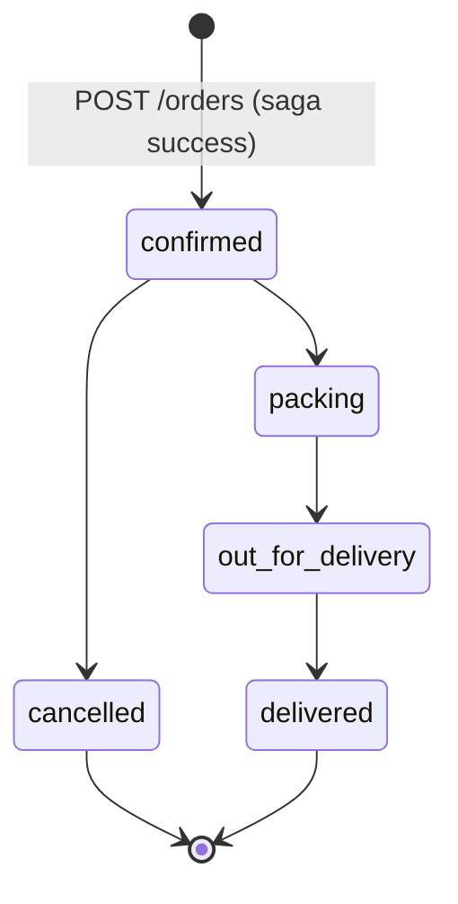

# FreshCart — System Design Outline

This document is the single source of truth for system design. It matches the current codebase (services, databases, communication, and observability).

---

## 1. System Overview

- **5 application services**, each with its own **database** (5 stores total: Redis + 3× PostgreSQL + MongoDB). **RabbitMQ** is the message broker (not a database).
- **Two communication patterns:** synchronous REST (client → gateway → backend; order → product) and asynchronous RabbitMQ (order-service publishes; notification-service and product-service consume from different queues).

```mermaid
flowchart TB
  subgraph Client
    C[Client app / web]
  end

  subgraph Gateway
    GW[API Gateway]
  end
  Redis[(Redis)]
  GW --> Redis

  subgraph "Backend services (REST via gateway)"
    US[User Service]
    PS[Product Service]
    OS[Order Service]
    NS[Notification Service]
  end

  C -->|HTTPS| GW
  GW -->|REST proxy| US
  GW -->|REST proxy| PS
  GW -->|REST proxy| OS
  GW -->|REST proxy| NS

  subgraph "Service → DB"
    UDB[(PostgreSQL\nfreshcart_users)]
    PDB[(PostgreSQL\nfreshcart_products)]
    ODB[(PostgreSQL\nfreshcart_orders)]
    MDB[(MongoDB\nfreshcart_notifications)]
  end
  US --> UDB
  PS --> PDB
  OS --> ODB
  NS --> MDB

  OS -->|sync REST\nGET/PATCH stock| PS

  subgraph Messaging
    RMQ[RabbitMQ\nexchange: orders]
  end
  OS -->|publish\norder.confirmed, order.*| RMQ
  RMQ -->|queue: notifications.order| NS
  RMQ -.->|queue: inventory.update\n(consumer exists; no producer in repo)| PS
```

**Notes:**

- **Gateway** is the only public entry point: auth (JWT), rate limit (Redis), correlation ID, reverse proxy to User / Product / Order / Notification.
- **Order → Product** is the only service-to-service HTTP: resilient client (circuit breaker, retry, 5s timeout) for product validation and stock reserve/release.
- **Order** is the only RabbitMQ publisher (exchange `"orders"`, routing keys e.g. `order.confirmed`, `order.packing`, …). **Notification** consumes `notifications.order`; **Product** has a consumer for `inventory.update`, but nothing in the repo publishes to that queue (dashed line).

---

## 2. Order Saga Flow (Create Order)

Flow as implemented in `order-service` `createOrderHandler`: no order row is persisted until after payment simulation; the only insert is with status `"confirmed"`.

```mermaid
sequenceDiagram
  participant Client
  participant Gateway
  participant Order as Order Service
  participant Product as Product Service
  participant DB as Order DB
  participant RMQ as RabbitMQ
  participant Notif as Notification Service

  Client->>Gateway: POST /api/v1/orders (Bearer token)
  Gateway->>Order: proxy (X-Correlation-ID, Authorization)

  Note over Order: Bulkhead: max 10 concurrent sagas

  loop For each line item
    Order->>Product: GET /api/v1/products/{id}
    Product-->>Order: 200 + product (or 404)
    alt product not found
      Order->>Product: release already-reserved (PATCH +qty)
      Order-->>Client: 400
    end
    Order->>Product: PATCH /api/v1/products/{id}/stock {"quantity": -qty}
    Product-->>Order: 200 or 409 (insufficient stock)
    alt 409 or error
      Order->>Product: release already-reserved (PATCH +qty)
      Order-->>Client: 409
    end
  end

  Note over Order: Simulate payment (100ms)
  Order->>DB: BEGIN; INSERT orders (status=confirmed); INSERT order_items; COMMIT
  alt DB error
    Order->>Product: release reserved stock
    Order-->>Client: 5xx
  end

  Order->>RMQ: Publish order.confirmed (headers: X-Correlation-ID, OTel)
  RMQ->>Notif: consume notifications.order
  Notif->>Notif: store notification (MongoDB), simulate email

  Order-->>Gateway: 201 + order
  Gateway-->>Client: 201
```

**Compensation (as in code):**

- If **product not found** or **stock reservation fails** (per item): release any already-reserved items via `PATCH` with positive quantity, then return 4xx.
- If **DB transaction fails** (insert order/items or commit): release all reserved stock, then return 5xx.
- **Payment** is simulated and never fails in current code; if it did, the intended behavior (per docs) is to release all reserved stock.

**Async failure handling:**

- If **notification consumer** fails (e.g. parse error, unknown routing key): message is Nack’d without requeue → **dead-letter queue** `notifications.order.dlq`.

---

## 3. State Machine (Order Status)

Order status is stored in `orders.status`. Transitions are enforced in `updateOrderStatusHandler`.



- **pending** is the DB column default; the saga does **not** persist an order with `pending` — it inserts directly as `confirmed`.
- **cancelled** triggers release of reserved stock (compensation).
- Status changes are published to RabbitMQ (e.g. `order.packing`, `order.delivered`); notification-service consumes and stores notifications.

---

## 4. Infrastructure & Observability

### 4.1 Deployment layout

- **Docker Compose:** one network; gateway on 8000, user 8081, product 8082, order 8083, notification 8084; Redis, 3× Postgres, MongoDB, RabbitMQ; Prometheus, Loki, Promtail, Jaeger, Grafana.
- **Kubernetes (Kind):**
  - **ns: ecommerce** — API Gateway, User, Product, Order, Notification (each with Service, Deployment, PDB; Gateway and Order have HPA).
  - **ns: ecommerce-data** — PostgreSQL (user, product, order), MongoDB, Redis, RabbitMQ (StatefulSet/Deployment + Services). NetworkPolicy: only ecommerce can reach ecommerce-data.
  - **ns: observability** — Prometheus, Loki, Promtail (DaemonSet), Grafana, **Jaeger** (OTLP HTTP 4318).

### 4.2 Per-pod surface

- **HTTP:** `/health`, `/ready`, `/metrics` (Prometheus).
- **Logging:** structured JSON (slog) with `service`, `correlation_id`, and often `trace_id`.
- **Tracing:** OpenTelemetry SDK; OTLP HTTP export to **Jaeger** (not Tempo). TraceContext + Baggage propagation; correlation ID is separate (X-Correlation-ID header / AMQP header).

### 4.3 Three pillars

| Pillar   | Stack                | Notes                                      |
|----------|----------------------|--------------------------------------------|
| **Logs** | Promtail → Loki      | Query by service, correlation_id, trace_id |
| **Metrics** | Prometheus scrape | RED + business (e.g. orders_created_total, order_saga_duration_seconds, circuit_breaker_state) |
| **Traces** | OpenTelemetry → **Jaeger** | OTLP HTTP; Jaeger UI for trace explorer |

Grafana is provisioned with Prometheus, Loki, and **Jaeger** datasources; dashboards and alert rules live in the repo.

### 4.4 Correlation ID

- **Generated** at API Gateway if the client does not send `X-Correlation-ID`.
- **Propagated** on every REST call (gateway → backends; order-service → product-service) and on every RabbitMQ publish (AMQP headers).
- **Consumers** (notification-service, product-service) read `X-Correlation-ID` from message headers and log it so that a single ID ties gateway, order, product, and notification logs (and optionally trace).

---

## 5. Resilience (Order → Product)

- **Circuit breaker:** 5 consecutive failures → open; 10s later → half-open; 3 successes → closed. Metric: `circuit_breaker_state` (0/1/2).
- **Retry:** up to 4 attempts (3 retries); exponential backoff + jitter; only 5xx (and connection errors) retried; 4xx returned as-is.
- **Timeout:** 5s on HTTP client.
- **Bulkhead:** semaphore of 10 for concurrent saga executions in order-service.

---

## 6. Reference: Existing SVG Diagrams

- **freshcart_system_overview.svg** — Largely correct; omit or annotate “RabbitMQ → Product (stock update)” (consumer exists, no producer). Add Gateway → Notification REST if desired.
- **freshcart_order_saga_flow.svg** — Flow is correct; diagram shows persisted “PENDING”/“PAYING” which the code does not use (order is inserted only as `confirmed`).
- **freshcart_infra_observability.svg** — Replace “OpenTelemetry → Tempo” with **“OpenTelemetry → Jaeger”** to match the stack.

This outline should stay in sync with the code; prefer updating this file and then adjusting the SVGs if needed.
